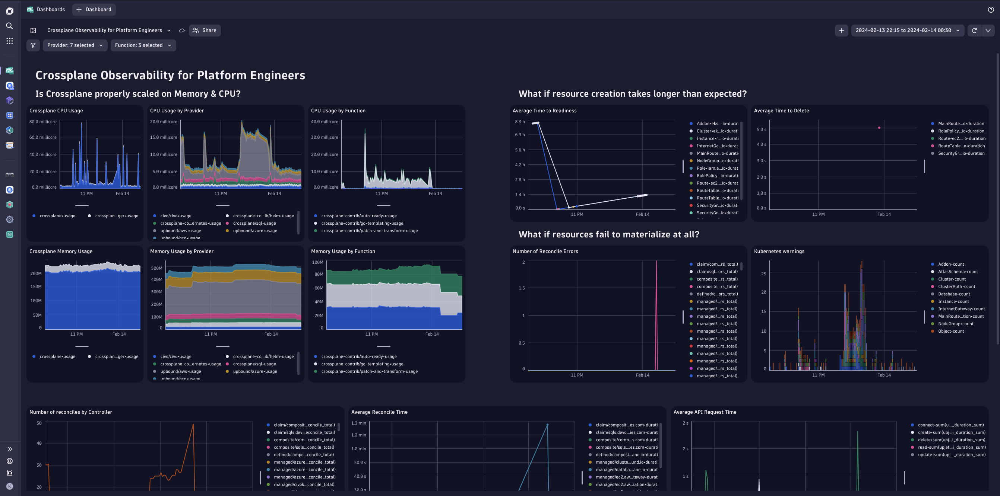

# Crossplane Observability Demo Dynatrace

This repository contains Helm charts with Dynatrace configuration for
the [crossplane-observability-demo](https://github.com/vfarcic/crossplane-observability-demo).

Installation instructions: https://katharinasick.github.io/crossplane-observability-demo-dashboards/.

Currently, this repository contains two Helm Charts:

## kubernetes-cluster

Contains dashboards relevant in the context of a Kubernetes cluster:

### Crossplane Metrics

A dashboard that visualizes some of the metrics Crossplane and its providers expose to ensure all resources are
deployed & reconciled correctly.

## kubernetes-workload

Contains a management zone, dashboard, alerting profiles & Slack notification configuration for a workload running in a
Kubernetes cluster.

